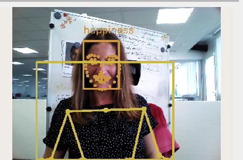

# hri_emotion_recognizer

## Overview

The `hri_emotion_recognizer` node is for emotion recognition using ONNX (Open Neural Network Exchange) models. It integrates  within the ROS4HRI framework by analyzing the output from the `hri_face_detector` node to identify emotional states.

For more information about ONNX Fer Plus models, visit [ONNX GitHub repository](https://github.com/onnx/models/tree/main/validated/vision/body_analysis/emotion_ferplus).

## Preparation

The emotion recognizer node relies on DNN models, currently supporting ONNX models,
collected in the [hri_emotion_models](https://gitlab.pal-robotics.com/ros4hri/hri_emotion_models) repository.

## Resources

- `dnn_models.emotion_recognition`:
  All the available emotion models are installed under this resource. It expects the 
  model name as saved in the hri_emotion_models/model/ folder. Note not all models may be supported at this time. 

## ROS API

### Topics

- **`/humans/faces/[face_id]/expression`**: This topic publishes the recognized emotion for each detected face. The message includes the detected emotion and its confidence score.
- `/diagnostics` ([diagnostic_msgs/DiagnosticArray](https://github.com/ros2/common_interfaces/blob/humble/diagnostic_msgs/msg/DiagnosticArray.msg))

## Parameters

- **`model`**: This parameter specifies the ONNX model used for emotion recognition. It is a string and defaults to `emotion-ferplus-8.onnx`. Other ONNX models can be used, but compatibility with this node should be verified as not all models may be compatible.
Models should be included in [hri_emotion_models/models](https://gitlab.pal-robotics.com/ros4hri/hri_emotion_models) directory. 


## Launch

```bash
ros2 launch hri_emotion_recognizer emotion_recognizer.launch.py
```

The `emotion_recognizer.launch.py` launch file accepts as arguments and configures the defined [parameters](#parameters).
It also automatically transitions the node to the active state.

## Example

To test thepackage using the system default microphone:

1. Install the `usb_cam` package:
   `sudo apt install ros-humble-usb-cam`
1. Launch the `usb_cam` package:
   `ros2 run usb_cam usb_cam_node_exe`
1. In a new terminal, install launch the `hri_face_detect` package:
   `sudo apt install ros-humble-hri-face-detect`
   `ros2 launch hri_face_detect face_detect.launch.py rgb_camera:=<input camera namespace>`
1. In a new terminal, run the `hri_emotion_recognizer` package: 
   `ros2 launch hri_emotion_recognizer emotion_recognizer.launch.py`
1. Check the faces tracked and the corresponding expression
   `ros2 topic echo /humans/faces/tracked`
   `ros2 topic echo /humans/faces/wstw/expression`

In RViz, add the Humans plugin to see the expression together with the faces detected.




